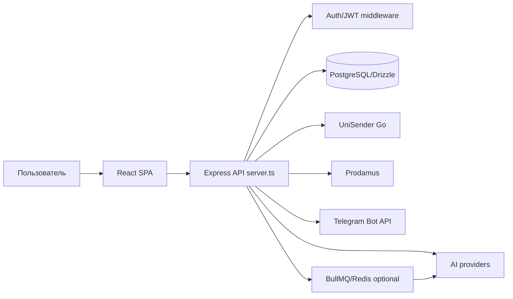
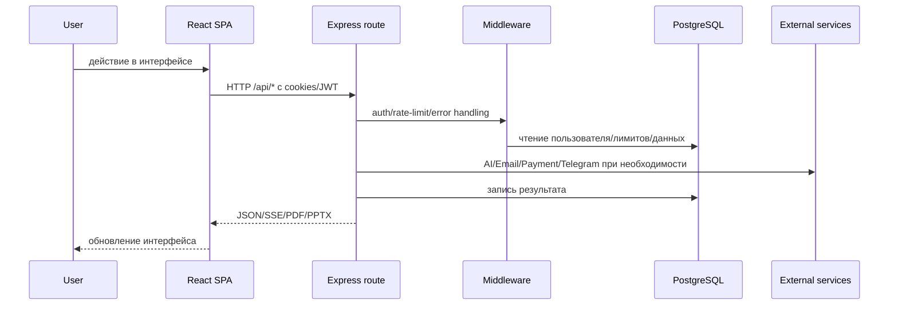

# 01. Project Overview

## Название проекта

**Uchion / Учён** — веб-сервис для учителей, который генерирует учебные материалы с помощью AI.

## Назначение проекта

Проект помогает пользователю быстро создать рабочие листы и презентации по школьным предметам, сохранить их в личном кабинете, скачать PDF/PPTX и управлять лимитами генераций через подписки или пакеты оплат.

## Для кого создан

- владелец проекта и администраторы сервиса;
- учителя и репетиторы;
- разработчики, поддерживающие веб-приложение;
- AI-ассистенты, которым нужно быстро понять проект перед изменениями.

## Основные возможности

| Возможность | Где реализовано |
|---|---|
| Генерация рабочих листов | `server/routes/generate.ts`, `api/_lib/generation/` |
| Генерация презентаций | `server/routes/presentations.ts`, `api/_lib/presentations/` |
| Личный кабинет, списки, папки | `src/pages/*ListPage.tsx`, `server/routes/worksheets.ts`, `server/routes/folders.ts` |
| Email-вход по коду | `server/routes/auth.ts`, `api/_lib/email.ts`, `db/schema.ts` (`email_codes`) |
| OAuth через Яндекс | `server/routes/auth.ts`, `api/_lib/auth/oauth.ts` |
| JWT/refresh-сессии | `api/_lib/auth/tokens.ts`, `db/schema.ts` (`refresh_tokens`) |
| Подписки и платежи Prodamus | `server/routes/billing.ts`, `server/routes/billing-webhook.ts`, `server/routes/billing-subscription-webhook.ts` |
| Telegram webhook и админ-уведомления | `server/routes/telegram.ts`, `api/_lib/telegram/`, `api/_lib/alerts/` |
| Админ-панель | `src/pages/admin/`, `server/routes/admin/` |
| AI-cost аналитика | `api/_lib/ai-usage.ts`, `server/routes/admin/ai-costs.ts`, `db/schema.ts` (`ai_usage`) |

## Технологический стек

- Frontend: React 18, Vite, TypeScript, React Router, TanStack Query, Zustand, Tailwind CSS.
- Backend: Express 5, TypeScript, `tsx` для dev, Node.js runtime.
- Database: PostgreSQL через Drizzle ORM и `postgres` driver.
- AI: OpenAI SDK/OpenAI-compatible API, набор провайдеров в `api/_lib/providers/`.
- PDF/PPTX: `pdf-lib`, Puppeteer/Chromium, `pptxgenjs`.
- Background jobs: BullMQ + Redis опционально (`USE_BULLMQ=true`), иначе in-process выполнение.
- Payments: Prodamus.
- Email: UniSender Go API.
- Telegram: Telegram Bot API webhook.

## Архитектура проекта

Проект — монорепозиторий с React SPA и Express API в одном репозитории. Express сервер монтирует API-маршруты под `/api/*`, в production отдает собранный frontend из `dist/`, а генераторы и интеграции переиспользуются из `api/_lib/`.

## Как запускается проект

Основные npm-скрипты определены в `package.json`:

| Команда | Назначение |
|---|---|
| `npm run dev` | параллельно запускает Vite frontend и Express backend |
| `npm run dev:frontend` | Vite dev server |
| `npm run dev:server` | `tsx watch server.ts` |
| `npm run build` | сборка frontend и server TypeScript |
| `npm start` | запуск `dist-server/server.js` |
| `npm run db:migrate` | Drizzle migrations |
| `npm run test:run` | unit/API tests через Vitest |
| `npm run test:e2e` | Playwright e2e |

## Основные сервисы

- PostgreSQL — основное хранилище пользователей, материалов, платежей, токенов, email-кодов.
- Redis — только при включенном BullMQ для очередей генерации.
- OpenAI-compatible AI endpoint — генерация контента и валидация.
- UniSender Go — отправка email-кодов.
- Prodamus — платежные ссылки, подписки, webhooks.
- Telegram Bot API — webhook, команды, уведомления админам.

## Внешние API

| API | Использование |
|---|---|
| OpenAI/OpenAI-compatible | генерация листов, презентаций, проверка/валидация |
| UniSender Go | email-коды для входа |
| Yandex OAuth | OAuth-аутентификация |
| Prodamus | платежи и подписки |
| Telegram Bot API | webhook, команды, уведомления |

## Базы данных

Найдена одна основная база: **PostgreSQL**. ORM-модели находятся в `db/schema.ts`, миграции — в `db/migrations/`.

## Основные зависимости

См. `09_DEPENDENCIES.md`. Критичные runtime-зависимости: `express`, `drizzle-orm`, `postgres`, `react`, `@tanstack/react-query`, `openai`, `bullmq`, `ioredis`, `pdf-lib`, `pptxgenjs`, `puppeteer-core`, `zod`.

## Поток обработки запроса

## Как пользователь взаимодействует с системой

1. Открывает React SPA.
2. Входит через email-код или Яндекс OAuth.
3. Создает рабочий лист или презентацию через формы генерации.
4. Backend проверяет авторизацию, лимиты и запускает генерацию.
5. Результат сохраняется в PostgreSQL и возвращается пользователю.
6. Пользователь просматривает, редактирует метаданные, скачивает PDF/PPTX, раскладывает материалы по папкам.
7. Для расширения лимитов пользователь покупает пакет или подписку через Prodamus.
