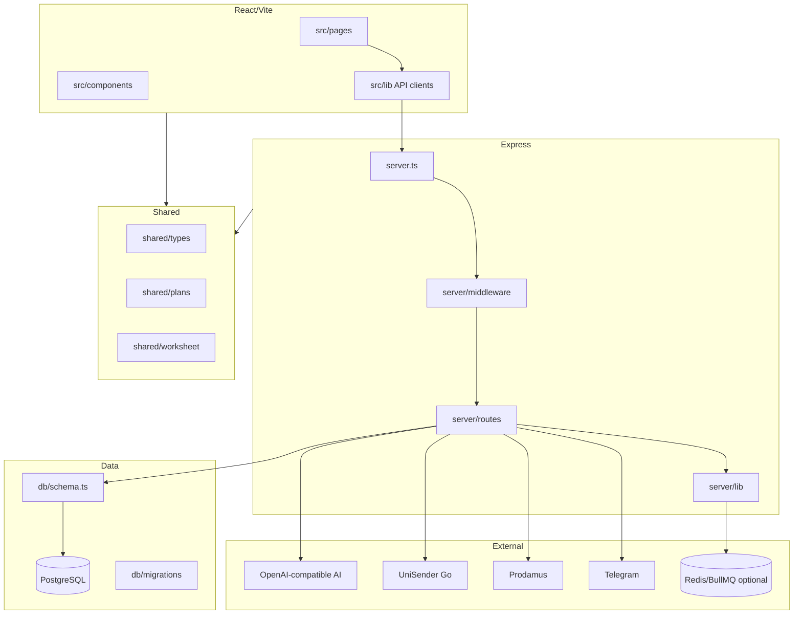
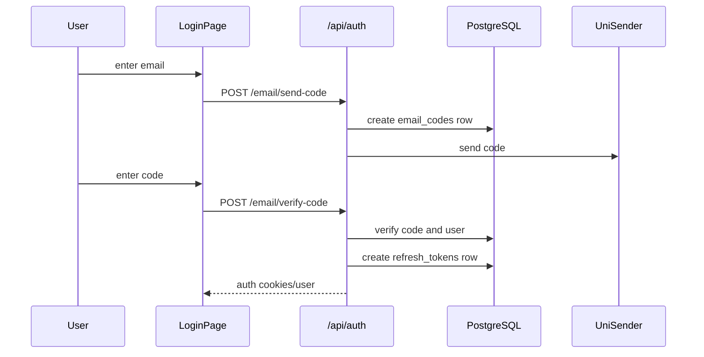

# 03. Architecture

## Общая схема

## Frontend

- Entry: `src/main.tsx`, app routing in `src/App.tsx`.
- Pages in `src/pages/` map to product screens: generation, saved worksheet/presentation, login, pricing, dashboard, legal docs.
- Admin pages live in `src/pages/admin/` and call `/api/admin/*`.
- API clients live in `src/lib/`: `api.ts`, `dashboard-api.ts`, `admin-api.ts`, `presentation-api.ts`, `pdf-client.ts`.
- State: `src/store/session.ts`, auth provider/helpers in `src/lib/auth.tsx`.
- Rendering: worksheet components, PDF modal, presentation preview/themes.

## Backend

- Main entrypoint: `server.ts`.
- Express middleware order: compression, JSON/urlencoded body parsing with raw body preservation for billing webhooks, cookies, CORS/origin checks, request logging/security headers/static serving/error handler.
- Routes mounted in `server.ts`:
  - `/api/auth`
  - `/api/folders`
  - `/api/worksheets`
  - `/api/generate`
  - `/api/presentations`
  - `/api/admin`
  - `/api/telegram`
  - `/api/billing`
  - `/api` health
  - `/api/public`
- Background startup tasks: optional queues, token cleanup interval, subscription expiry interval.

## API

API is REST-like JSON plus some streaming/SSE during generation and binary/document responses for PDF/PPTX. Full route map: `04_API_MAP.md`.

## Database

- PostgreSQL.
- Drizzle schema: `db/schema.ts`.
- Connection: `db/index.ts`.
- Active migrations: `db/migrations/`.
- Main data domains: users, refresh tokens, email codes, folders, worksheets, presentations, generations, subscriptions, payments, payment intents, webhook events, AI usage.

## Authentication

- Email OTP: `server/routes/auth.ts`, `api/_lib/email.ts`, `email_codes` table.
- Yandex OAuth: `/api/auth/yandex/redirect`, `/api/auth/yandex/callback`.
- JWT helpers: `api/_lib/auth/tokens.ts`.
- Cookie helpers: `api/_lib/auth/cookies.ts` and `server/middleware/cookies.ts`.
- Route guards: `server/middleware/auth.ts` (`withAuth`, `optionalAuth`, admin variants).

## Middleware

| Middleware | Файл | Назначение |
|---|---|---|
| Auth | `server/middleware/auth.ts` | JWT/session lookup, `withAuth`, admin checks |
| Rate limit | `server/middleware/rate-limit.ts` | memory/Redis-like request limits by identifier/prefix |
| Cookies | `server/middleware/cookies.ts` | set/clear/read auth cookies |
| Error handler | `server/middleware/error-handler.ts` | centralized JSON errors |
| Audit log | `server/middleware/audit-log.ts` | audit wrapper for sensitive/admin actions |
| Express built-ins in `server.ts` | `server.ts` | compression, parsers, CORS/security/static |

## Telegram

- Webhook endpoint: `POST /api/telegram/webhook` in `server/routes/telegram.ts`.
- Secret verification: `TELEGRAM_WEBHOOK_SECRET` header token.
- Bot API wrapper: `api/_lib/telegram/bot.ts`.
- Command processing: `api/_lib/telegram/commands.ts`.
- Admin alert settings: `server/routes/admin/settings.ts` updates `telegramChatId`/`wantsAlerts` in `users`.
- Generation alerts: `api/_lib/alerts/generation-alerts.ts`.

## Email

- Provider: UniSender Go HTTP API in `api/_lib/email.ts`.
- Auth flow in `server/routes/auth.ts`.
- Data table: `email_codes`.
- SMTP not found; direct UniSender API is used.

## Cron / intervals

No standalone cron framework was found. Scheduled background behavior uses `setInterval` in `server.ts`:

- refresh token cleanup;
- subscription expiry/downgrade safety net.

Frontend also uses intervals for UI polling/countdown, not backend jobs.

## Storage

- Persistent app data: PostgreSQL.
- Static frontend assets: `public/`, `dist/` after build.
- Generated PDF/PPTX appears stored inline/serialized in DB fields (`pdfUrl`, `docxUrl`, `pptxBase64`) or returned/generated on demand. No S3/object storage integration found.
- Redis is optional queue infrastructure, not primary storage.

## Shared

`shared/` contains cross-cutting contracts. Treat changes here as high impact because they affect both server and client.

## Utils

- Backend utilities: `server/lib/`, `api/_lib/*`.
- Frontend utilities: `src/lib/`, `src/hooks/`.
- Scripts: `scripts/` for operational/manual tasks.

## Tests

- Unit: `tests/unit/`.
- API: `tests/api/`.
- E2E: `tests/e2e/`.
- Test runner: Vitest and Playwright.
