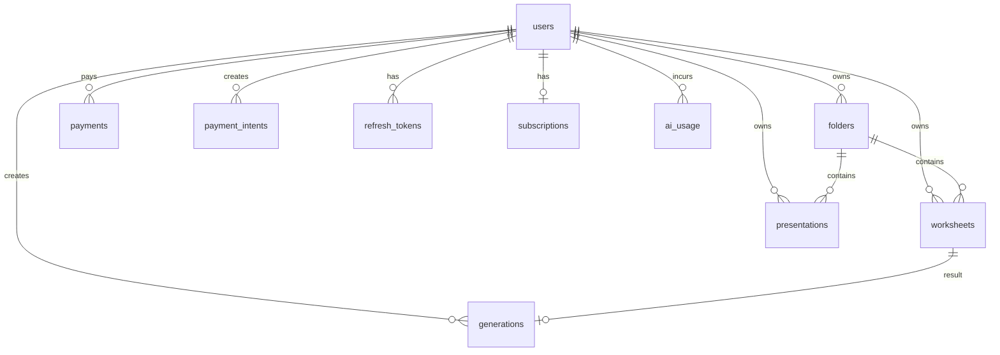

# 05. Database

## Overview

Database: PostgreSQL. ORM: Drizzle ORM. Schema source: `db/schema.ts`. Active migrations: `db/migrations/`.

## Enums

| Enum | Values | Назначение |
|---|---|---|
| `user_role` | `user`, `admin` | роли пользователей |
| `subscription_plan` | `free`, `basic`, `premium` | legacy enum; фактически новые plans хранятся varchar |
| `subscription_status` | `active`, `canceled`, `expired`, `trial` | legacy enum |
| `generation_status` | `pending`, `processing`, `completed`, `failed` | статус генерации |
| `payment_status` | `pending`, `succeeded`, `failed`, `refunded` | legacy payments |
| `payment_intent_status` | `created`, `paid`, `failed`, `expired` | payment intent lifecycle |
| `subject` | `math`, `algebra`, `geometry`, `russian` | legacy enum; worksheets now use varchar subject |
| `difficulty` | `easy`, `medium`, `hard` | сложность worksheet |
| `presentation_theme_type` | `preset`, `custom` | тип темы презентации |
| `presentation_theme_preset` | `professional`, `educational`, `minimal`, `scientific`, `kids`, `school` | preset themes |

## Tables

### `users`

Назначение: аккаунты пользователей, роли, лимиты, подписка, OAuth, referral, Telegram alert settings.

Ключевые поля: `id`, `email`, `role`, `generationsLeft`, `subscriptionPlan`, `hasPaidAccess`, `provider`, `providerId`, `mailingConsent`, `telegramBonusClaimed`, `telegramChatId`, `wantsAlerts`, `referralCode`, `referredBy`, `deletedAt`.

Связи: one-to-many с worksheets, folders, generations, presentations, payments, payment_intents, refresh_tokens, ai_usage; one-to-one с subscriptions.

Где используется: auth, admin users, billing, generation limits, Telegram settings, referrals.

### `folders`

Назначение: пользовательские папки для материалов.

Ключевые поля: `id`, `userId`, `name`, `color`, `parentId`, `sortOrder`, `deletedAt`.

Связи: belongs to user; self-parent; contains worksheets and presentations.

Где используется: `/api/folders`, worksheet/presentation list filters and move operations.

### `worksheets`

Назначение: сохраненные рабочие листы.

Ключевые поля: `id`, `userId`, `folderId`, `title`, `subject`, `grade`, `topic`, `difficulty`, `content`, `pdfUrl`, `docxUrl`, `deletedAt`.

Связи: belongs to user/folder; linked generation via `generations.worksheetId`.

Где используется: generation, worksheet list/detail/update/delete, PDF rebuild/download.

### `generations`

Назначение: журнал генераций worksheet.

Ключевые поля: `id`, `userId`, `worksheetId`, `status`, `subject`, `grade`, `topic`, `errorMessage`, `startedAt`, `completedAt`.

Связи: belongs to user, optional worksheet.

Где используется: generation route, admin generation history, analytics/alerts.

### `subscriptions`

Назначение: текущая Prodamus recurring subscription per user.

Ключевые поля: `userId` unique, `prodamusSubscriptionId`, `prodamusProfileId`, `plan`, `status`, `generationsPerPeriod`, `currentPeriodStart`, `currentPeriodEnd`, `customerEmail`, `cancelledAt`.

Связи: one-to-one user.

Где используется: billing links, subscription webhooks, cancellation, expiry job, admin.

### `payments`

Назначение: legacy/simple payment records.

Ключевые поля: `id`, `userId`, `amount`, `status`, `providerPaymentId`, `createdAt`.

Связи: belongs to user.

Где используется: billing effects/admin payments; может быть legacy alongside `payment_intents`.

### `payment_intents`

Назначение: созданные платежные намерения/заказы для Prodamus.

Ключевые поля: `id`, `userId`, `productCode`, `amount`, `currency`, `status`, `provider`, `providerOrderId`, `providerPaymentId`, `metadata`, `paidAt`, `expiresAt`.

Связи: belongs to user.

Где используется: create payment/subscription link, payment status, webhooks, admin.

### `webhook_events`

Назначение: idempotency log для webhook processing.

Ключевые поля: `provider`, `eventKey`, `rawPayloadHash`, `processedAt`; unique index on provider+eventKey.

Связи: no FK.

Где используется: Prodamus webhooks and admin webhook events page.

### `refresh_tokens`

Назначение: refresh JWT rotation and revocation.

Ключевые поля: `userId`, `jti`, `familyId`, `expiresAt`, `revokedAt`.

Связи: belongs to user.

Где используется: login, refresh, logout, token cleanup interval.

### `email_codes`

Назначение: OTP-коды для passwordless email login.

Ключевые поля: `email`, `code`, `expiresAt`, `attempts`, `usedAt`, `createdAt`.

Связи: no FK by email.

Где используется: `/api/auth/email/send-code`, `/api/auth/email/verify-code`.

### `presentations`

Назначение: сохраненные презентации.

Ключевые поля: `userId`, `folderId`, `title`, `subject`, `grade`, `topic`, `themeType`, `themePreset`, `themeCustom`, `slideCount`, `structure`, `pptxBase64`.

Связи: belongs to user/folder.

Где используется: presentation generation, list/detail/update/delete, PPTX downloads/previews.

### `ai_usage`

Назначение: учет AI-вызовов, токенов, стоимости и длительности.

Ключевые поля: `sessionId`, `userId`, `callType`, `model`, `promptTokens`, `completionTokens`, `costKopecks`, `durationMs`, `subject`, `grade`.

Связи: belongs to user.

Где используется: AI providers/generation, admin AI costs.

## Migrations and seeds

- Active migrations found: `db/migrations/*.sql` with Drizzle meta snapshots.
- Backup migrations found: `db/migrations_backup/`.
- Dedicated seed files not found. Требуется дополнительная проверка перед созданием seed workflow.
