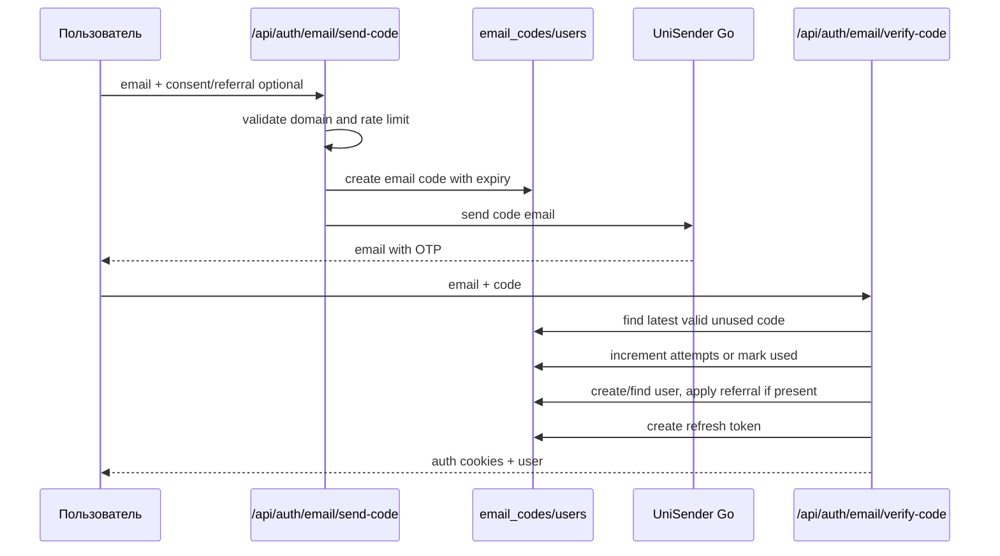

# 06. Email System

## Summary

Email is used for passwordless login by one-time code. The project uses **UniSender Go API**, not SMTP.

## Components

| Component | File/table | Notes |
|---|---|---|
| API routes | `server/routes/auth.ts` | `/email/send-code`, `/email/verify-code` |
| Sender | `api/_lib/email.ts` | HTTP call to UniSender Go |
| OTP storage | `db/schema.ts` table `email_codes` | code, expiry, attempts, used marker |
| User creation/login | `server/routes/auth.ts` | creates or finds `users` |
| Token issue | `api/_lib/auth/tokens.ts`, cookies helpers | access/refresh tokens |
| Rate limits | `server/routes/auth.ts`, `server/middleware/rate-limit.ts` | route-level limits |

## Provider and SMTP

- SMTP configuration: **Не найдено в проекте.**
- Provider: **UniSender Go** via API key `UNISENDER_GO_API_KEY`.
- From email in code: `noreply@ychion.ru`.

## Templates

Dedicated template files were not found. Email body appears built in `api/_lib/email.ts` by code. If marketing/transactional templates exist in UniSender dashboard, they are external to this repository and require additional verification.

## Flow

## Confirmation code behavior

Known from schema:

- code length column is 6 chars;
- `expiresAt` controls lifetime;
- `attempts` tracks failed verification attempts;
- `usedAt` prevents reuse.

Exact TTL/max attempts/rate-limit values are implemented in `server/routes/auth.ts`; check that file before modifying login behavior.

## Rate limit

Rate limiting is present around auth routes and shared middleware. Exact identifiers and windows must be checked in `server/routes/auth.ts` and `server/middleware/rate-limit.ts` before changes.

## Errors

Expected error categories:

- invalid email/domain;
- too many requests;
- provider/API key missing or email send failure;
- invalid/expired code;
- too many attempts;
- DB/user/token errors.

Do not change error text/status without checking frontend handling in `src/pages/LoginPage.tsx` and auth client code.

## Missing pieces

- SMTP: Не найдено в проекте.
- Separate email queue: Не найдено в проекте.
- Template files: Не найдено в проекте.
